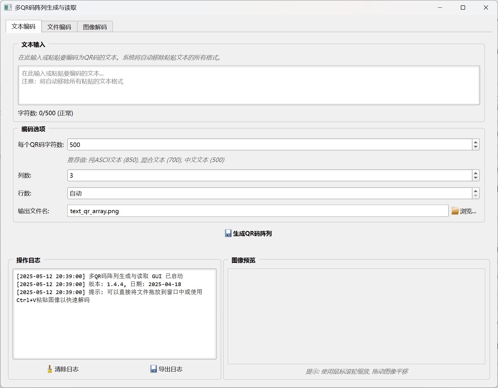
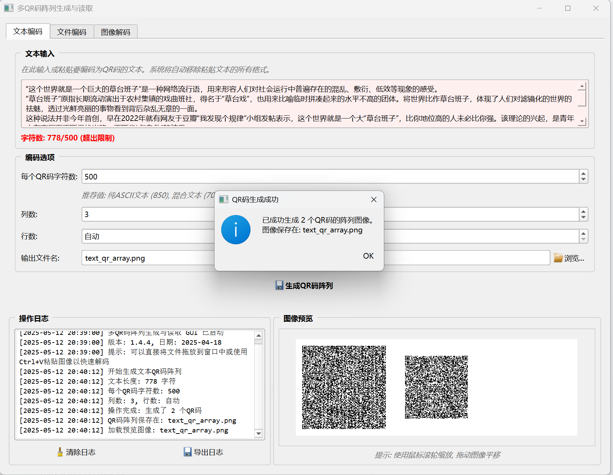
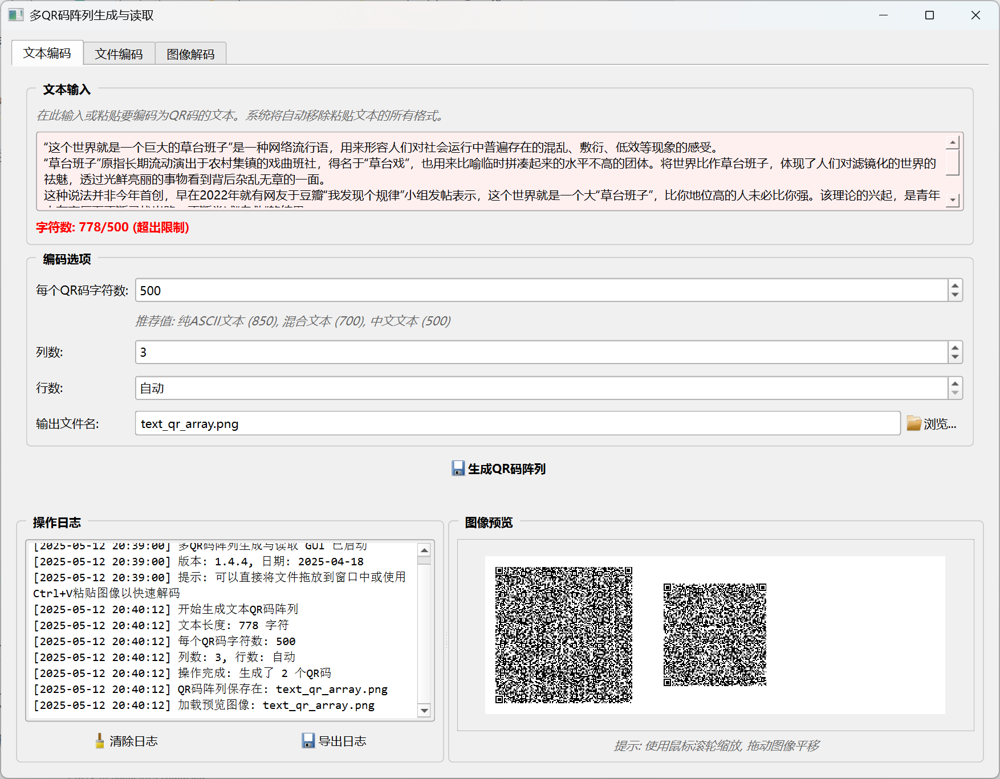
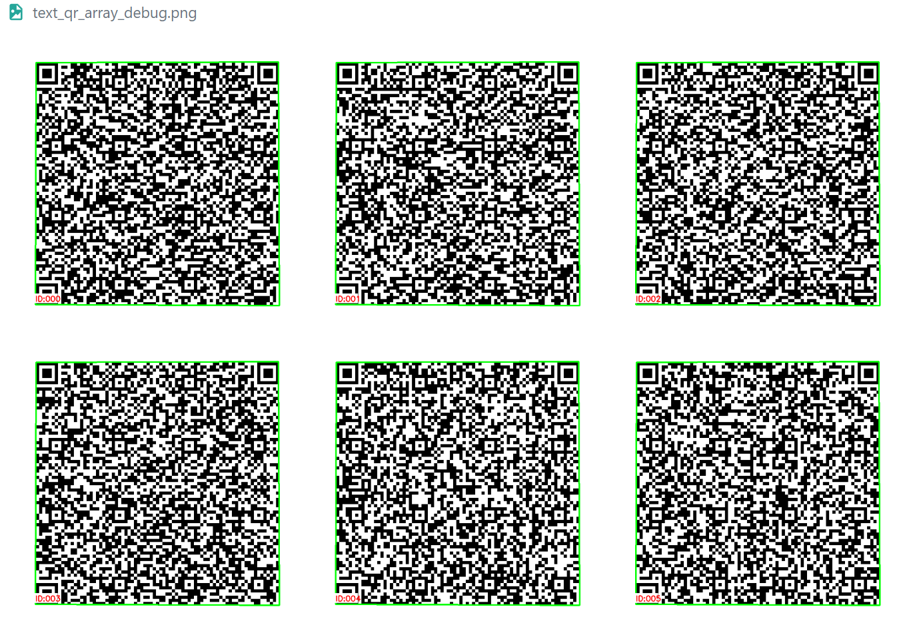
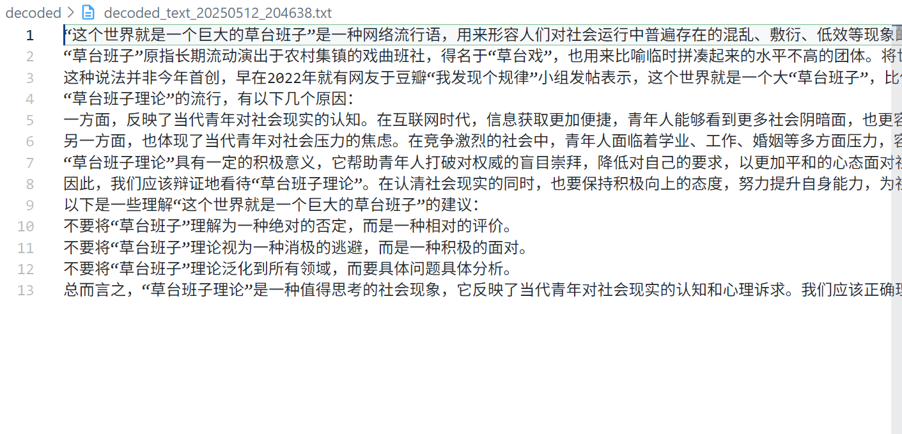

# Multi-QR Code Array Generator and Reader

English | [中文](README_zh.md)

[](https://opensource.org/licenses/MIT)
[](https://www.python.org/downloads/)
[](https://pypi.org/project/PyQt6/)
[](CHANGELOG.md)

A tool for encoding large texts or files into multiple QR codes arranged in arrays, and decoding them back to the original content. Particularly useful for **transferring large amounts of data without network connectivity** (such as between isolated networks), overcoming the limitations of single QR codes and avoiding format corruption issues when transmitting in segments.

## Background & Purpose

In specialized network environments (like isolated intranet systems), data transfer faces significant challenges:
- Single QR codes have limited capacity (typically less than 4KB)
- Transmitting multiple QR codes separately can lead to code structure disruption or sequence confusion
- Manual reassembly of multiple text blocks is error-prone

This project solves these issues through innovative design:
- Intelligently splits large texts into multiple indexed QR codes
- Arranges these QR codes in a specific pattern to form an array image
- Uses a specialized decoding tool to accurately identify each QR code and its index
- Precisely reconstructs the original data regardless of size, maintaining format and structural integrity

## Quick Start

### 1. Install Dependencies

On Windows, use PowerShell to run:

```powershell
pip install -r requirements.txt
```

### 2. Launch the GUI

```powershell
python run_gui.py
```

After launching, you'll see the following interface:

<div align="center">
  
  <p><i>Figure 1: Multi-QR Code Array Tool Main Interface</i></p>
</div>

### 3. Usage Workflow

#### 3.1 Encoding Text to QR Code Array

1. Enter or paste text in the text editing area
2. Set appropriate text block size and layout options based on content type
   
<div align="center">
  
  <p><i>Figure 2: Input Text and Configure Encoding Options</i></p>
</div>

3. Click "Generate QR Code Array" button
4. View the generated QR code array image at the specified output location

<div align="center">
  
  <p><i>Figure 3: Generated Multi-QR Code Array</i></p>
</div>

#### 3.2 Decoding from QR Code Array

1. Switch to the "Image Decode" tab
2. Click "Browse" to select a QR code array image (or import from camera, drag-and-drop, paste image)
3. Check "Visual Debug" to see the recognition process and index numbers

<div align="center">
  
  <p><i>Figure 4: Decoding Process and Visual Debug Interface Showing QR Code Indices</i></p>
</div>

4. Click "Decode QR Code Array" button
5. View the decoded text content in the result area

<div align="center">
  
  <p><i>Figure 5: Text Display Interface After Decoding</i></p>
</div>

#### 3.3 File Encoding

No need to provide text manually, directly encode files:
1. Switch to the "File Encoding" tab
2. Select the file to encode
3. Configure encoding options
4. Click "Generate QR Code Array" button

> **Tip**: There is no strict limit on the number of QR codes that can be processed, but it is primarily constrained by the camera resolution and screen size. In practical applications, adjust the QR code quantity and size according to your screen dimensions and camera quality for optimal transfer results.

## Features

- Split long texts into multiple chunks
- Generate indexed QR codes for each text chunk
- Arrange multiple QR codes in a two-dimensional array
- Read QR code arrays and identify the content of each code
- Reconstruct original text using index information
- Support for Chinese and Unicode characters
- Support for binary file transfer (via Base64 encoding)
- Graphical user interface for ease of use
- Support for multiple image formats (PNG, JPG, JPEG, BMP, WebP, TIFF, etc.)

## Project Files

The project consists of the following main files:

| Filename | Description |
| --- | --- |
| `generate_qr_array.py` | Implements core QR code generation functionality, splitting text and creating QR code arrays |
| `read_qr_array.py` | Implements QR code array reading functionality, identifying QR codes and reconstructing text |
| `qr_code_file_transfer.py` | File transfer module, supporting encoding and decoding of any file to/from QR code arrays |
| `qr_array_gui.py` | Graphical user interface implementation based on PyQt6, providing intuitive operation |
| `run_gui.py` | Entry script for launching the graphical interface |
| `requirements.txt` | List of project dependencies |
| `README.md` | Project documentation |
| `CHANGELOG.md` | Version update history |

### Core Functionality File Details

- **generate_qr_array.py**:
  - Implements text splitting functionality
  - Generates indexed QR codes for each text chunk (using "IDX:000:" index prefix format)
  - Arranges multiple QR codes into an array image
  - Supports custom row/column numbers and text chunk size for each QR code
  - Includes error handling and version control logic

- **read_qr_array.py**:
  - Extracts all QR codes from the array
  - Parses the content and index of each QR code
  - Reconstructs text in index order
  - Provides visual debugging functionality
  - Supports multiple index formats with strong error tolerance
  - Supports multiple image formats (PNG, JPG, JPEG, BMP, WebP, TIFF, etc.)

- **qr_code_file_transfer.py**:
  - Encapsulates file encoding and decoding logic
  - Supports text and binary file transfer
  - Uses Base64 encoding for binary data
  - Provides command-line interface
  - Supports decoding of plain text and file-marked QR codes

- **qr_array_gui.py**:
  - PyQt6-based graphical interface
  - Provides text encoding, file encoding, and image decoding functions
  - Supports file selection and saving
  - Includes image preview and logging functions
  - Uses worker threads for long operations to prevent UI freezing
  - Supports reading QR code arrays in multiple image formats

## Installing Dependencies

On Windows, use PowerShell to install required libraries:

```powershell
pip install -r requirements.txt
```

Or install dependencies individually:

```powershell
pip install qrcode pillow opencv-python pyzbar numpy PyQt6
```

## Usage

### Graphical User Interface

Launch the graphical user interface for intuitive operation:

```powershell
python run_gui.py
```

The GUI contains three main function tabs:
1. **Text Encoding**: Encode input text into a QR code array
2. **File Encoding**: Encode any file into a QR code array
3. **Image Decoding**: Decode a QR code array image to recover the original text/file

The bottom of the interface provides operation log viewing and image preview functionality.

### Command Line Interface

#### Generating QR Code Arrays

Run the `generate_qr_array.py` file:

```powershell
python generate_qr_array.py
```

You can modify the `sample_text` variable in the code to generate QR code arrays containing custom text.

#### Reading QR Code Arrays

Run the `read_qr_array.py` file:

```powershell
python read_qr_array.py
```

This will default to reading the `qr_array.png` file in the current directory. It also supports reading other image formats (such as JPG, BMP, etc.).

#### Using File Transfer Functionality

The file transfer functionality provides more complete features for encoding any file into a QR code array and recovering files from QR code arrays:

**Encoding Files:**

```powershell
python qr_code_file_transfer.py encode <file_path> [--chunk-size <characters_per_QR>] [--rows <rows>] [--cols <columns>] [--output <output_filename>]
```

For example:

```powershell
python qr_code_file_transfer.py encode test_message.txt --chunk-size 200 --cols 3
```

**Decoding Files:**

```powershell
python qr_code_file_transfer.py decode <QR_array_image_path> [--output-dir <output_directory>] [--debug]
```

For example:

```powershell
python qr_code_file_transfer.py decode test_message_qr_array.png --output-dir recovered
```

## Parameter Explanation

### QR Code Array Generation Parameters

- `text`: Text content to encode
- `chunk_size`: Maximum characters per QR code
- `rows`: Number of rows in the array (optional, calculated automatically by default)
- `cols`: Number of columns in the array (optional, calculated automatically by default)
- `output_file`: Output QR code array image filename

### QR Code Array Reading Parameters

- `array_image_path`: Path to the QR code array image (supports PNG, JPG, JPEG, BMP, WebP, TIFF, etc.)
- `visual_debug`: Whether to display visual debugging information

## Encoding Notes

This project supports Chinese and other Unicode characters. To ensure correct display of Chinese characters on various systems, we use UTF-8-SIG encoding (UTF-8 with BOM) when writing recovered text files.

### About Chinese Character Encoding Issues

If Chinese characters appear as garbled text, it may be due to encoding mismatches. In such cases:

1. Ensure your Python environment supports UTF-8
2. Use UTF-8-SIG encoding when opening and writing files
3. On some special systems, you may need to specify the correct encoding when reading files

## Examples

Here's a complete example demonstrating how to use this project to transfer files:

```python
# Encode a file to QR code array
python qr_code_file_transfer.py encode important_document.txt --chunk-size 500 --cols 4

# Decode a file from QR code array
python qr_code_file_transfer.py decode important_document_qr_array.png --output-dir recovered
```

You can also use the graphical interface for more intuitive operation:

```python
python run_gui.py
```

## Notes

- QR codes need sufficient white space between them to ensure correct recognition
- Too many QR codes in an array may make recognition difficult
- Each QR code has limited capacity; smaller chunk sizes (such as 200-500 characters) are recommended
- For images and other binary files, Base64 encoding will increase data volume by approximately 33%
- High-quality cameras and good lighting conditions are recommended when reading QR code arrays
- When using lossy compression formats like JPG, image quality may affect QR code recognition; use lossless formats like PNG or maintain high image quality

## Contributing

Improvements and code contributions to this project are welcome. Please check [CONTRIBUTING.md](CONTRIBUTING.md) to learn how to contribute.

## License

This project is licensed under the MIT License. See the [LICENSE](LICENSE) file for details.

## Version History

Check [CHANGELOG.md](CHANGELOG.md) for version update history. 